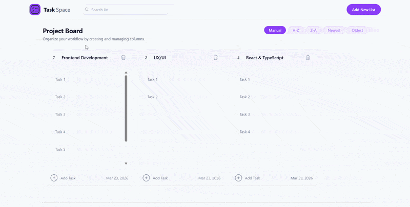

# TaskSpace 🗂️

> A modern, drag-and-drop project board built with React, TypeScript and @dnd-kit — designed to organize workflows with speed, clarity, and a polished user experience.


---

## 🔗 Live Demo

👉 https://task-manager-dnd.vercel.app/

---

## 📌 Highlights

- Designed a **scalable state structure** for nested data (columns + tasks)
- Implemented **accessible drag-and-drop interactions** using `@dnd-kit`
- Optimized rendering with **memoization (`useMemo`) to prevent unnecessary re-renders**
- Built with a strong focus on **UX, performance, and accessibility**
- Structured for **maintainability and clean component separation**

---

## ✨ Features

- **Drag & Drop Columns** — Smooth, accessible reordering powered by `@dnd-kit`
- **Inline Editing** — Edit tasks and titles instantly (no modals, no friction)
- **Task Management** — Create, update, and delete tasks effortlessly
- **Smart Sorting** — Sort columns by name (A–Z / Z–A) or creation date
- **Live Search** — Real-time filtering with zero extra interactions
- **Persistent State** — Data stored in `localStorage`
- **Fully Responsive** — Optimized for desktop, tablet, and mobile
- **Accessible UI** — ARIA labels, keyboard navigation, and semantic HTML

---

## 🛠️ Tech Stack

| Layer | Technology |
|---|---|
| Framework | React 18 + Vite |
| Language | TypeScript |
| Styling | Tailwind CSS v3 |
| Drag & Drop | @dnd-kit/core + @dnd-kit/sortable |
| State | React hooks (`useState`, `useMemo`, `useEffect`) |
| Persistence | Browser `localStorage` |

---

## 🚀 Getting Started

### Prerequisites

- Node.js ≥ 18
- npm or yarn

### Installation

```bash
# Clone the repository
git clone https://github.com/your-username/taskspace.git
cd taskspace

# Install dependencies
npm install

# Run development server
npm run dev
```
 
Open [http://localhost:5173](http://localhost:5173) in your browser — you're all set!
 
### Build for production
 
```bash
npm run build
```
 
---
 
## 📁 Project Structure
 
```
src/
├── assets/          # SVG icons (logo, search, plus, delete)
├── components/
│   ├── Navbar.tsx         # Top bar: logo, search input, add button
│   ├── ProjectsArea.tsx   # DnD context + sort controls + column grid
│   ├── TaskContainer.tsx  # Individual column with header, task list, footer
│   └── TaskCard.tsx       # Single task item with inline edit & delete
├── types.ts         # Shared TypeScript types (Column, Task, Id)
└── App.tsx          # Root component: global state + handlers
```
 
---
 
## 🧠 Architecture Decisions
 
### Flat state, lifted up
All data lives in a single `columns` state in `App.tsx`. Each column owns its tasks as a nested array. This keeps the data model simple, predictable, and easy to serialize to `localStorage`.
 
### useMemo for derived data
Filtering and sorting are computed with `useMemo`, so the UI stays snappy even as the dataset grows — without unnecessary re-renders.
 
### @dnd-kit over alternatives
`@dnd-kit` was chosen for its modular API, first-class TypeScript support, and excellent accessibility out of the box — a meaningful advantage over older libraries like `react-beautiful-dnd`.
 
### DragOverlay for ghost element
When dragging a column, a `DragOverlay` renders a visual clone instead of mutating the real DOM — avoiding layout shifts and delivering a polished drag experience.
 
---
 
## 📸 Preview

### Drag and Drop Demo


---
 
## 👤 Author

**Otoniel Gómez**

Frontend Developer focused on building scalable, accessible, and user-centered interfaces.

- 🌐 Portfolio: https://frontend-portfolio-ts.vercel.app/
- 💼 LinkedIn: https://www.linkedin.com/in/otoniel-gomez-03gt/
- 💻 GitHub: https://github.com/OtonielG

🚀 Open to remote opportunities
 
---
 
<p align="center">Made with ❤️ and a lot of ☕</p>
